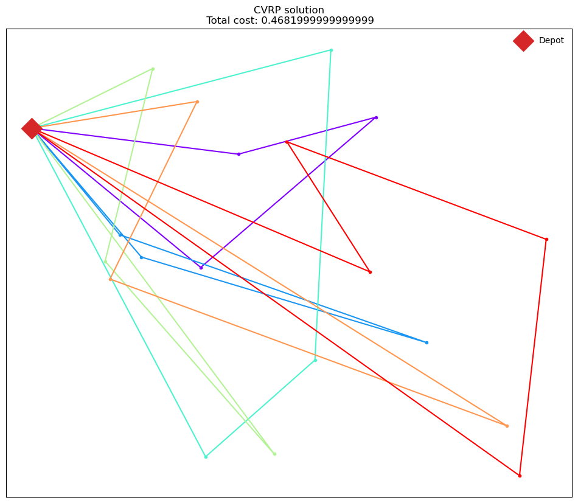

# DFL-VRP

## The readme is under construction, stay tuned!

A solved CVRP

## References:

Wouda, N.A., and L. Lan (2023). ALNS: a Python implementation of the adaptive large neighbourhood search metaheuristic. Journal of Open Source Software, 8(81): 5028. https://doi.org/10.21105/joss.05028